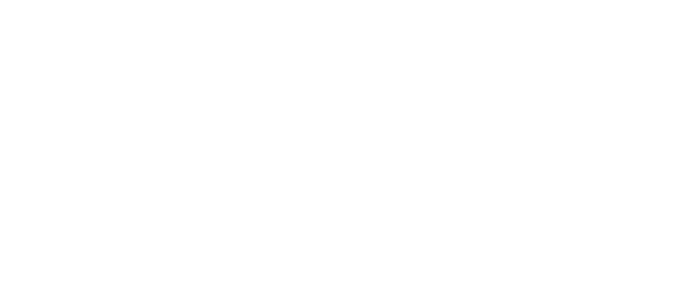

<h1 align='center'>
  From pixels to prognosis: RectoMap offers a smart path from MRI scans to rectal cancer insights
</h1>

<p align="center">
<strong>RectoMap</strong> provides a powerful deep learning-based pipeline for <strong>rectal cancer</strong> segmentation and <strong>mesorectum</strong> delineation from T2-weighted MRI scans, enabling more accurate and reliable tumor analysis. By combining state-of-the-art models and ensemble techniques, RectoMap offers a robust solution to clinical challenges in cancer treatment planning and monitoring.

<p align="center">
  
</p>


## 🔬 About this repository

This repository provides a deep learning pipeline for the segmentation of rectal cancer and mesorectum from T2-weighted MRI scans. The second part of the pipeline, focused on predicting **pathological complete response** (pCR) after neoadjuvant therapy, will be **released soon**! 

We trained and evaluated **two state-of-the-art models** for medical image segmentation:

-  `nnUNet 3D`
-  `U-MambaBot 3D`

The models were trained on a highly diverse dataset, which includes subjects scanned with **17 different MRI scanners** and varying acquisition protocols. This diversity helps improve the models' generalizability. The training involved a 5-fold cross-validation approach, and data augmentation techniques were applied to optimize model performance. To improve segmentation consistency and robustness across patients, the predictions generated by each model are combined using a **[STAPLE](https://ieeexplore.ieee.org/document/1309714)-based ensemble** strategy.

The table below provides an overview of the models used in the RectoMap pipeline. Each model corresponds to a specific fold in the 5-fold cross-validation approach used during training.

<div align="center">
  
| Model ID | Architecture  | Training Time | Best Dice (val) | Training Epochs |
|:----------:|:---------------:|:--------------:|:------------------:|:------------------:|
| fold0    | nnUNet 3D     | 23:33:55     | 0.6940             | 1000             | 
| fold1    | UMambaBot 3D  | 1-07:47:56   | 0.6853             | 1000             | 
| fold2    | nnUNet 3D     | 21:19:49     | 0.7453             | 1000             | 
| fold3    | nnUNet 3D     | 1-00:18:10   | 0.7364             | 1000             | 
| fold4    | nnUNet 3D     | 1-00:15:19   | 0.6627             | 1000             | 

</div>


## ⚙️ Environment Setup

Create a conda environment, clone the repository and install the dependencies:
```bash
# Create and activate a conda environment
conda create -n RectoMap_env python=3.9 -y
conda activate RectoMap_env

# Clone the repository
git clone https://github.com/perrasimon/RectoMap.git
cd RectoMap

# Install the dependencies from the requirements.txt file
pip install -r requirements.txt
```

Once the environment is set up and dependencies are installed, you can add the custom trainers:
```bash
# Move the custom trainer files to the appropriate directory:
cd custom_trainers
cp nnUNetTrainer_AUG_3d.py nnUNetTrainerUMambaBot_AUG_3d.py RectoMap/src/nnunetv2/umamba/nnunetv2/training/nnUNetTrainer/
```
These custom trainers extend the default nnUNet training routines to include advanced **data augmentation** strategies. In particular, they incorporate [**TorchIO**](https://torchio.readthedocs.io/) and [**GIN**](https://github.com/cheng-01037/Causality-Medical-Image-Domain-Generalization)-based transforms designed to simulate realistic **MRI artifacts** (e.g., motion, ghosting, bias field).

## 📥 Model weights download
```bash
#Download the five pretrained models and install them into your environment
for i in {0..4}; do
  wget https://github.com/perrasimon/RectoMap/releases/download/v1.0.0/fold$i.zip
  nnUNetv2_install_pretrained_model_from_zip fold$i.zip
done
```

## 🚀 How to Run
To run predictions using all 5 pretrained models and automatically perform ensembling, use the following command:

```bash
RectoMap_run.sh -i /path/to/input/images/folder -o /path/to/output/folder
```

This script will automatically create **6 output subdirectories** inside the specified output folder:
- ```predictions_fold0``` to ```predictions_fold4```: contain predictions from each individual model.
- ```RectoMap_ouput```: contains the final ensembled segmentation masks generated using the STAPLE algorithm.

Please make sure that:

- ```-i```: path to the **input folder** containing the MRI images to be predicted. The images must be in NIfTI format with a .nii.gz extension.
- ```-o```: path to the **output folder** where predictions and the ensembled results will be saved.


## 🙏 Acknowledgments
This work is heavily based on the [nnUNet](https://github.com/MIC-DKFZ/nnUNet) and [U-Mamba](https://github.com/bowang-lab/U-Mamba) frameworks.
If you use this tool in your research, please make sure to **cite** the original authors by referencing them.


