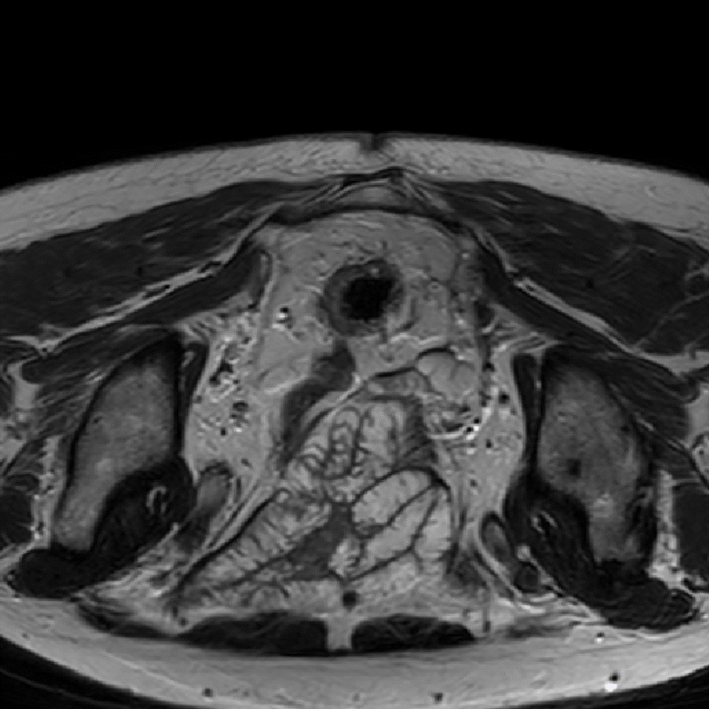

<h1>
  
  RectoMap
</h1>

<h3 align="center">
  From Pixels to Prognosis: Automatic MRI Segmentation of Rectal Tumors and Mesorectum  
  for Smarter Radiomics and pCR Prediction
</h3>

<p align="center">
  
</p>


## 🔬 About This Repository

This repository provides a deep learning pipeline for the segmentation of **rectal cancer** and **mesorectum** from **T2-weighted MRI scans**.

We developed and evaluated **five state-of-the-art models** for medical image segmentation:

- 🧪 `nnUNet`
- ⚡ `uMambaBot`
- 🔁 `Swin-UMamba` (pretrained)
- 🚫 `Swin-UMamba` (trained from scratch)
- 🌀 `Swin-UNETR`

The predictions generated by each model are combined using a **STAPLE-based ensemble** strategy, which improves segmentation consistency and robustness across patients.

---

## 🗂️ Repository Structure
├── models/ # Trained weights or model configs 
├── scripts/ # Inference and training scripts 
├── images/ # Example outputs and visualizations 
├── data/ # MRI examples or sample data (optional) 
├── README.md # You're here!

## 🧪 Model Details
- Framework: PyTorch + MONAI + nnUNet
- Trained on: [brief description of your dataset]
- Targets: Label 1 = rectal tumor, Label 2 = mesorectum

## 🚀 How to Run

```bash
# Clone the repo
git clone https://github.com/your-username/rectal-mri-segmentation.git
cd rectal-mri-segmentation

# Set up environment (example with conda)
conda create -n rectal_seg python=3.9
conda activate rectal_seg
pip install -r requirements.txt

# Run inference (example script)
bash scripts/run_prediction.sh
```

## 📊 Example Output
<p align="center">  </p>

## 📎 Related Publications & Credits
STAPLE reference: Warfield et al., Simultaneous Truth and Performance Level Estimation (STAPLE).

nnUNet: Isensee et al., nnU-Net: a self-configuring method for deep learning-based biomedical image segmentation.

## 📬 Contact
For questions or collaboration, feel free to reach out:
Simone Perra – University of Padova
📧 simone.perra@unipd.it
